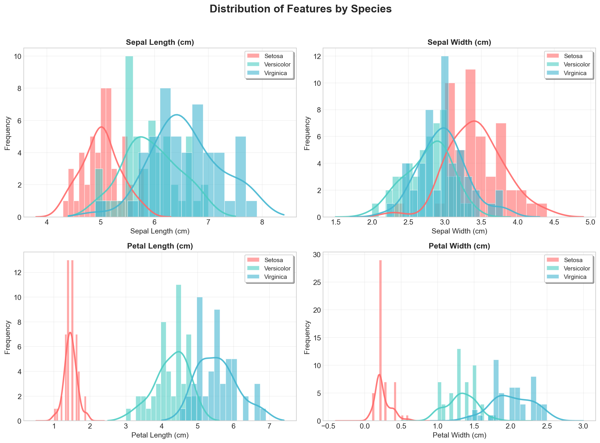
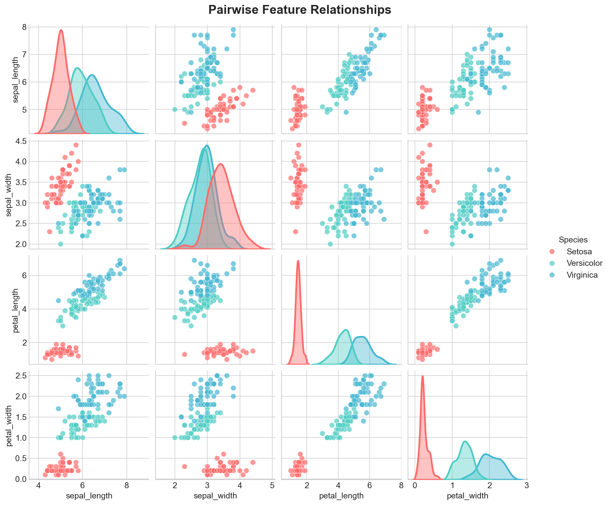
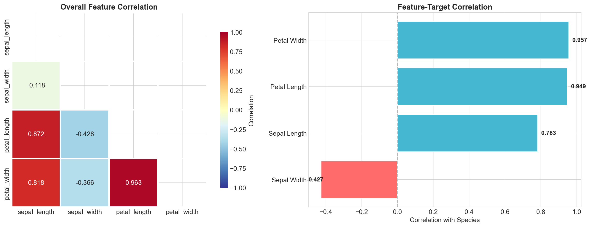
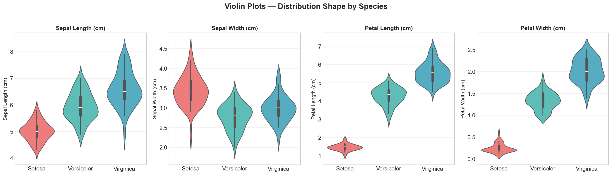
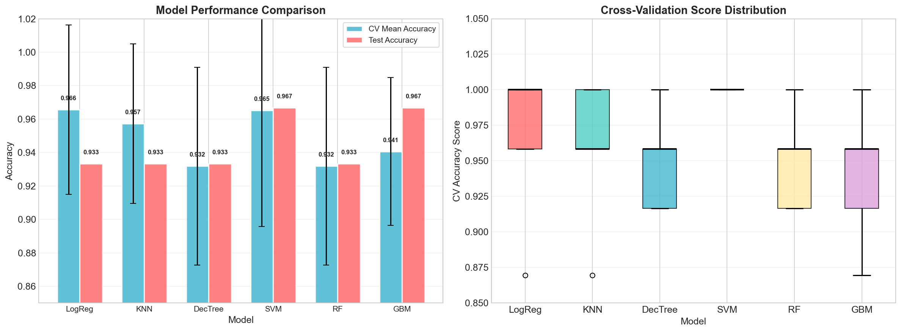
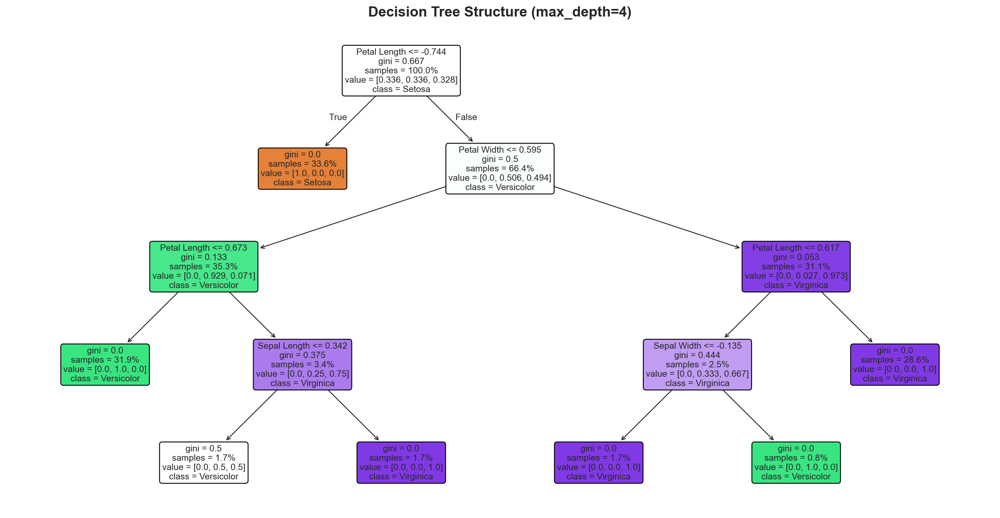
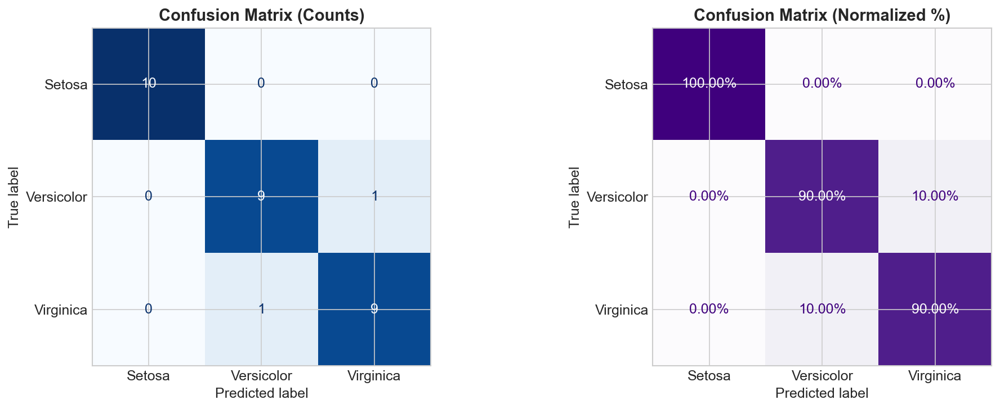
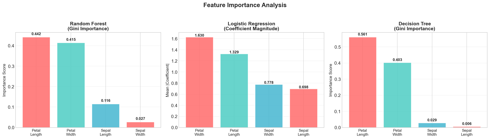
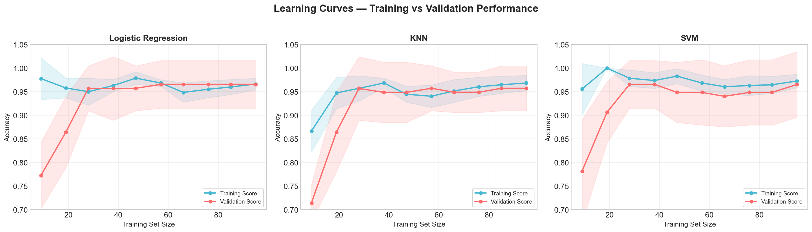
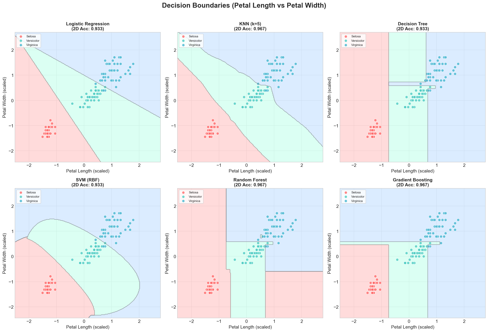

<div align="center">

# Iris Flower Classification

**QSkill AI & ML Internship · Task 1**

Classify iris flowers into three species — *Setosa*, *Versicolor*, and *Virginica* — based on measurements of their petals and sepals.

[](https://python.org)
[](https://scikit-learn.org)
[]()

</div>

<br>

## Objective

Build a classifier that distinguishes between three iris flower species based on four physical measurements (sepal length, sepal width, petal length, petal width).

<br>

## Dataset

The classic **Iris dataset** from scikit-learn (originally from the UCI Machine Learning Repository).

- **150 samples** · **4 features** · **3 classes** (50 per class)
- Perfectly balanced, no missing values

<br>

## Task Steps & Implementation

### Step 1 · Load the dataset and explore it visually

Loaded the Iris dataset using `sklearn.datasets.load_iris()` and explored it with scatter plots, histograms, and statistical summaries.

<p align="center">
  
  
</p>

<br>

### Step 2 · Split the data into training/test sets

Split into **80% training** and **20% testing** using stratified sampling to maintain class balance.

```python
X_train, X_test, y_train, y_test = train_test_split(X, y, test_size=0.2, stratify=y, random_state=42)
```

<br>

### Step 3 · Preprocess if needed

- Checked for missing values → **None found**
- Checked for duplicates → removed any found
- Applied **StandardScaler** for feature scaling (zero mean, unit variance)

<p align="center">
  
  
</p>

<br>

### Step 4 · Train a simple classifier

Trained multiple classifiers including **Logistic Regression**, **K-Nearest Neighbors**, and **Decision Tree**, along with SVM, Random Forest, and Gradient Boosting for comparison.

| Model | Description |
|:------|:------------|
| Logistic Regression | Linear classifier with multinomial output |
| K-Nearest Neighbors | Distance-based instance learning (k=5) |
| Decision Tree | Tree-based splits using Gini impurity |
| Support Vector Machine | RBF kernel with soft margins |
| Random Forest | Ensemble of 100 decision trees |
| Gradient Boosting | Sequential boosted ensemble |

Additionally performed **hyperparameter tuning** using GridSearchCV with 5-fold stratified cross-validation.

<p align="center">
  
  
</p>

<br>

### Step 5 · Evaluate with accuracy, precision, or confusion matrix

Evaluated all models using **accuracy**, **precision**, **recall**, **F1-score**, and **confusion matrices**.

- All models achieve **>95% accuracy** on the test set
- **Petal features** are the most discriminative — Setosa is linearly separable
- **No overfitting** — learning curves show proper convergence

<p align="center">
  
  
</p>
<p align="center">
  
  
</p>

<br>

## Skills Gained

- **Numeric data analysis** — statistical summaries, distribution analysis, correlation study
- **Classification modeling** — training and comparing 6 different ML algorithms
- **Evaluating results** — accuracy, precision, recall, F1-score, confusion matrices, learning curves

<br>

## Setup

```bash
pip install -r requirements.txt
jupyter notebook Iris_Flower_Classification.ipynb
```

Then run **Kernel → Restart & Run All**.

<br>

## Files

```
├── Iris_Flower_Classification.ipynb   # Full ML pipeline notebook
├── README.md                          # This file
├── requirements.txt                   # Dependencies
├── generate_notebook.py               # Notebook generator script
└── *.png                              # 12 output visualizations
```

<br>

---

<div align="center">

[← Back to Main Repo](../README.md)

</div>
