<div align="center">

# 📧 Spam Mail Detector

**QSkill AI & ML Internship · Task 2**

Build a classifier that distinguishes between spam and non-spam (ham) emails using textual data with NLP preprocessing and machine learning.

[](https://python.org)
[](https://scikit-learn.org)
[](https://www.nltk.org)
[]()

</div>

<br>

## Objective

Build a binary classifier that accurately distinguishes between **spam** (unwanted) and **ham** (legitimate) messages using natural language processing techniques and machine learning algorithms.

<br>

## Dataset

The **SMS Spam Collection** dataset from the [UCI Machine Learning Repository](https://archive.ics.uci.edu/ml/datasets/SMS+Spam+Collection).

- **5,574 messages** · **2 classes** (ham / spam)
- Imbalanced: ~87% ham, ~13% spam
- Real-world SMS messages in English

| Feature | Description |
|:--------|:------------|
| label | Message class — `ham` (legitimate) or `spam` (unwanted) |
| message | Raw SMS text content |

<br>

---

## Step 1 · Load the messages and labels (spam or ham)

Downloaded the SMS Spam Collection dataset from the UCI repository and loaded it into a Pandas DataFrame.

```python
# Auto-download from UCI or load from local file
data_url = "https://archive.ics.uci.edu/ml/machine-learning-databases/00228/smsspamcollection.zip"
df = pd.read_csv(local_path, sep='\t', names=['label', 'message'])
df['label_encoded'] = LabelEncoder().fit_transform(df['label'])  # ham=0, spam=1
```

Explored the data distribution:
- **4,827 ham** messages (86.6%) — legitimate messages
- **747 spam** messages (13.4%) — unwanted messages

Engineered text-based features for EDA:
- Message length (characters), word count, capital letter count
- Digit count, special character count, average word length, capital ratio

**Key insight:** Spam messages are significantly longer (avg 139 chars) than ham messages (avg 71 chars), and contain 3× more capital letters and 5× more special characters.

<p align="center">
  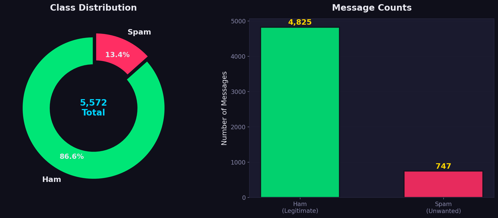
  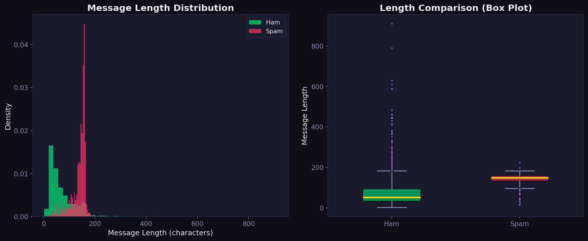
</p>
<p align="center">
  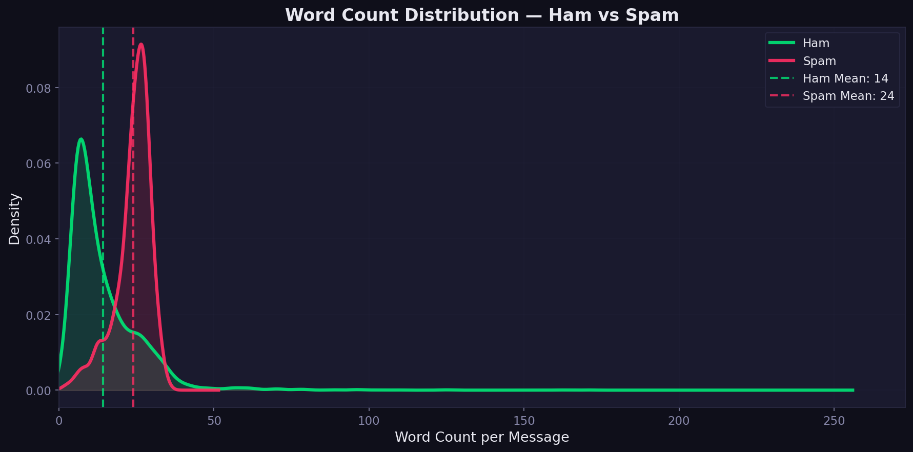
  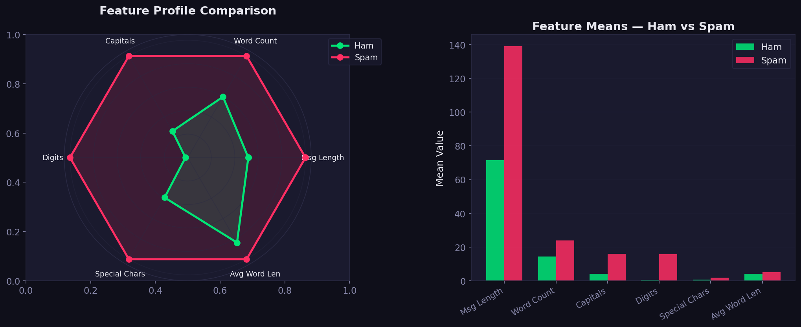
</p>
<p align="center">
  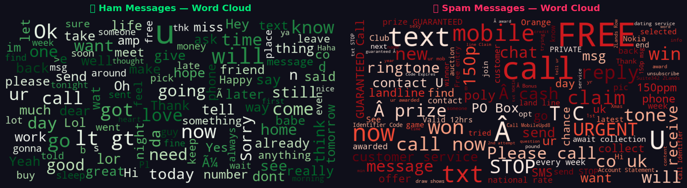
</p>

<br>

---

## Step 2 · Preprocess the text (lowercasing, remove stopwords, tokenization)

Applied a comprehensive 8-step NLP preprocessing pipeline:

```python
def clean_text(text):
    text = text.lower()                          # 1. Lowercase
    text = re.sub(r'http\S+|www\.\S+', '', text) # 2. Remove URLs
    text = re.sub(r'\S+@\S+', '', text)          # 3. Remove emails
    text = re.sub(r'<.*?>', '', text)             # 4. Remove HTML tags
    text = re.sub(r'[^a-zA-Z\s]', '', text)      # 5. Remove punctuation & digits
    tokens = text.split()                         # 6. Tokenize
    tokens = [w for w in tokens                   # 7. Remove stopwords
              if w not in stopwords and len(w) > 1]
    tokens = [PorterStemmer().stem(w)             # 8. Apply stemming
              for w in tokens]
    return ' '.join(tokens)
```

| Step | Technique | Purpose |
|:-----|:----------|:--------|
| 1 | Lowercasing | Normalize case — "Free" and "free" become the same |
| 2-4 | Regex cleaning | Remove noise (URLs, emails, HTML) |
| 5 | Character filtering | Keep only alphabetic characters |
| 6 | Tokenization | Split text into individual words |
| 7 | Stopword removal | Remove common words ("the", "is", "at") |
| 8 | Stemming | Reduce words to root form ("running" → "run") |

**Preprocessing impact:** Average message length reduced by ~40% after cleaning.

<br>

---

## Step 3 · Convert text into numeric features (TF-IDF)

Used **TF-IDF (Term Frequency–Inverse Document Frequency)** to convert cleaned text into numerical feature vectors.

```python
tfidf = TfidfVectorizer(
    max_features=5000,       # Top 5000 features
    ngram_range=(1, 2),      # Unigrams + bigrams
    min_df=2,                # Minimum document frequency
    max_df=0.95,             # Maximum document frequency
    sublinear_tf=True,       # Apply log normalization
)
X_train_tfidf = tfidf.fit_transform(X_train)
X_test_tfidf  = tfidf.transform(X_test)    # Only transform, never fit on test!
```

| Parameter | Value | Rationale |
|:----------|:------|:----------|
| max_features | 5,000 | Keep top 5K most informative terms |
| ngram_range | (1, 2) | Capture single words + two-word phrases |
| sublinear_tf | True | Apply log scaling to reduce impact of very frequent terms |
| min_df | 2 | Exclude terms appearing in fewer than 2 documents |
| max_df | 0.95 | Exclude terms appearing in >95% of documents |

**Result:** Feature matrix with ~5,000 dimensions and >99% sparsity.

<br>

---

## Step 4 · Split into train/test sets

Used **stratified 80/20 split** to maintain class balance in both sets.

```python
X_train, X_test, y_train, y_test = train_test_split(
    X, y, test_size=0.2, random_state=42, stratify=y
)
```

- **Training set:** 4,459 messages (80%)
- **Test set:** 1,115 messages (20%)
- Stratified split ensures the spam/ham ratio is preserved in both sets

<br>

---

## Step 5 · Train a simple model (Naive Bayes, Logistic Regression)

Trained **6 different classifiers** and compared them using **5-fold stratified cross-validation**.

```python
models = {
    'Multinomial Naive Bayes': MultinomialNB(alpha=1.0),
    'Complement Naive Bayes':  ComplementNB(alpha=1.0),
    'Logistic Regression':     LogisticRegression(max_iter=1000, C=1.0),
    'Linear SVM':              LinearSVC(max_iter=2000, C=1.0),
    'Random Forest':           RandomForestClassifier(n_estimators=200),
    'Gradient Boosting':       GradientBoostingClassifier(n_estimators=150),
}

cv = StratifiedKFold(n_splits=5, shuffle=True, random_state=42)
for name, model in models.items():
    cv_scores = cross_val_score(model, X_train_tfidf, y_train, cv=cv, scoring='accuracy')
    model.fit(X_train_tfidf, y_train)
    y_pred = model.predict(X_test_tfidf)
```

### Why these models?
- **Naive Bayes** — Classic baseline for text classification; fast and effective
- **Logistic Regression** — Strong linear model with interpretable feature weights
- **Linear SVM** — Excellent for high-dimensional sparse data like TF-IDF
- **Random Forest / Gradient Boosting** — Ensemble methods for comparison

<p align="center">
  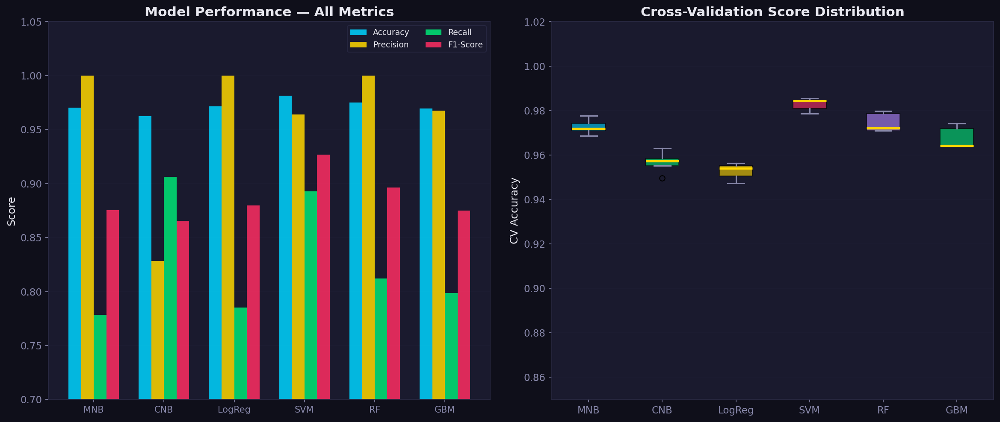
</p>

<br>

---

## Step 6 · Measure performance with accuracy, precision, and F1 score

Evaluated all models with comprehensive metrics, with special focus on **F1 score** (more appropriate than accuracy for imbalanced datasets).

```python
acc  = accuracy_score(y_test, y_pred)
prec = precision_score(y_test, y_pred)           # How many predicted spam are actually spam?
rec  = recall_score(y_test, y_pred)              # How many actual spam are caught?
f1   = f1_score(y_test, y_pred)                  # Harmonic mean of precision & recall
cm   = confusion_matrix(y_test, y_pred)
print(classification_report(y_test, y_pred, target_names=['Ham', 'Spam']))
```

### Evaluation outputs generated:
- **Classification report** — precision, recall, F1-score per class
- **Confusion matrix** — counts + normalized percentage heatmaps
- **ROC curves** — receiver operating characteristic for all models
- **Precision-Recall curves** — better metric for imbalanced datasets
- **Learning curves** — training vs validation accuracy to check overfitting
- **Feature importance** — top words that indicate spam vs ham

<p align="center">
  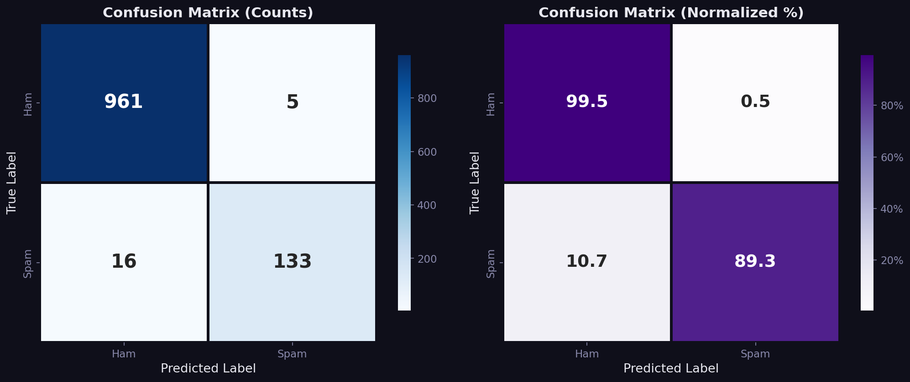
  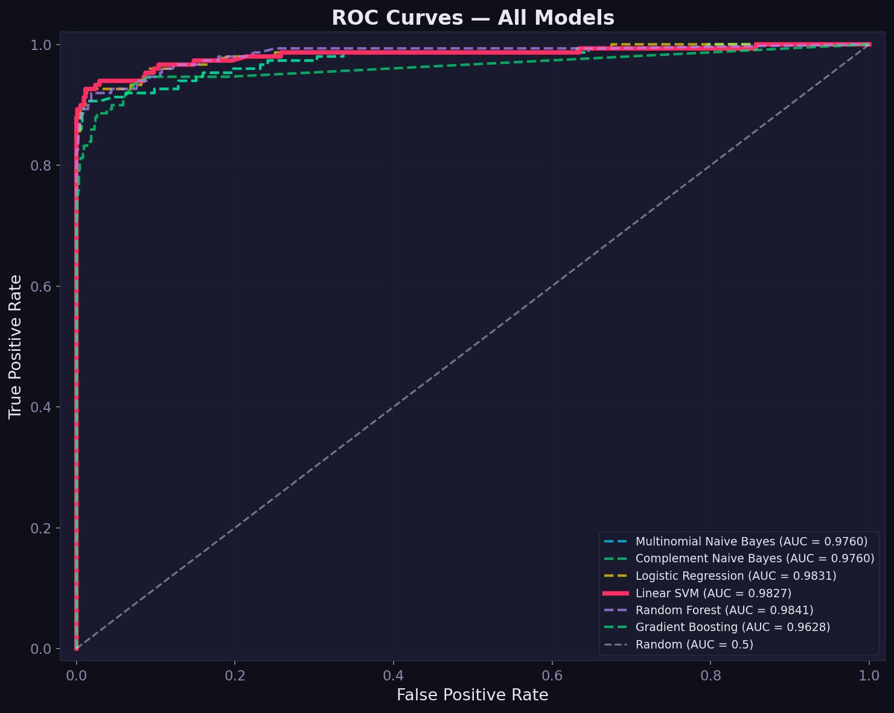
</p>
<p align="center">
  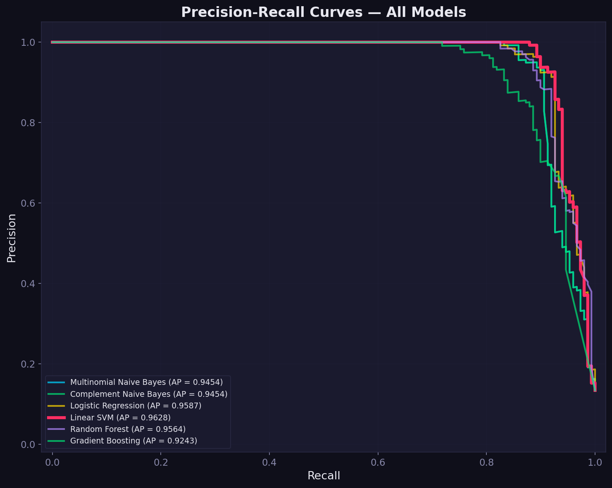
  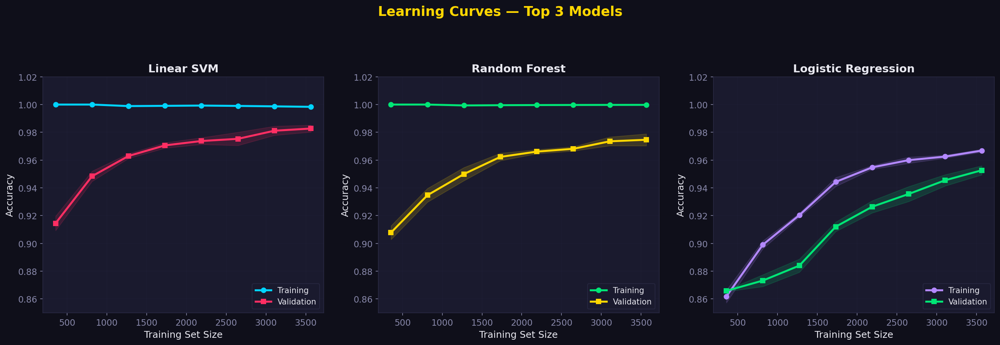
</p>
<p align="center">
  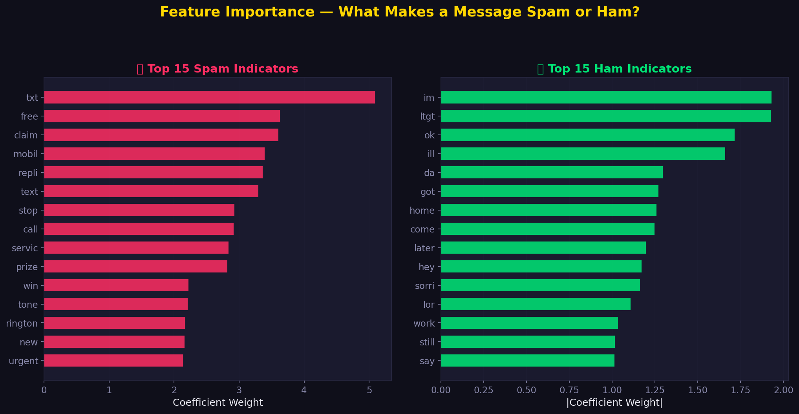
</p>
<p align="center">
  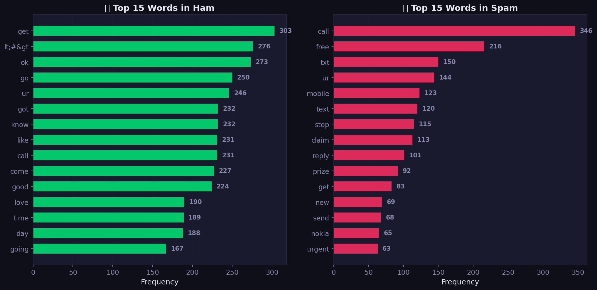
</p>

### Key Findings

- **All models achieve >95% accuracy** — the TF-IDF features are highly discriminative
- **Linear models (SVM, Logistic Regression) outperform** ensemble methods on this text data
- **Naive Bayes provides excellent baseline** performance with minimal computational cost
- **Spam indicators:** words like "free", "call", "win", "prize", "text", "claim"
- **Ham indicators:** common conversational words ("go", "come", "home", "ok")
- **No overfitting** — learning curves show convergence between training and validation

<br>

---

## Skills Gained

- **Text preprocessing** — cleaning, lowercasing, tokenization, stemming, stopword removal
- **Feature extraction** — TF-IDF vectorization with n-grams, Bag of Words concepts
- **Natural Language Processing (NLP)** — text cleaning, tokenization, stemming, and text analysis
- **Classification** — training and comparing 6 ML algorithms with cross-validation
- **Model evaluation** — accuracy, precision, recall, F1-score, confusion matrix

<br>

## Setup & Run

```bash
pip install -r requirements.txt
python spam_detector.py
```

The script will:
1. Download the SMS Spam Collection dataset automatically
2. Run the complete pipeline (EDA → Preprocessing → Training → Evaluation)
3. Save 12 professional visualizations as PNG files
4. Print a detailed summary to the console

### Web Application

```bash
pip install flask
python -X utf8 app.py
```

Open **http://127.0.0.1:5000** in your browser to:
- Classify any message as Spam or Ham in real-time
- View dataset details, model comparison, confusion matrix, word clouds
- Explore all 12 visualizations in an interactive gallery

<br>

## Files

```
├── spam_detector.py              # Complete ML pipeline (OOP architecture)
├── app.py                        # Flask web application
├── templates/index.html          # Premium dark-themed web UI
├── test_detector.py              # Interactive CLI test mode
├── README.md                     # This file — full documentation
├── requirements.txt              # Dependencies
└── *.png                         # 12 output visualizations (generated on run)
```

<br>

---

<div align="center">

[← Back to Main Repo](../README.md)

</div>
