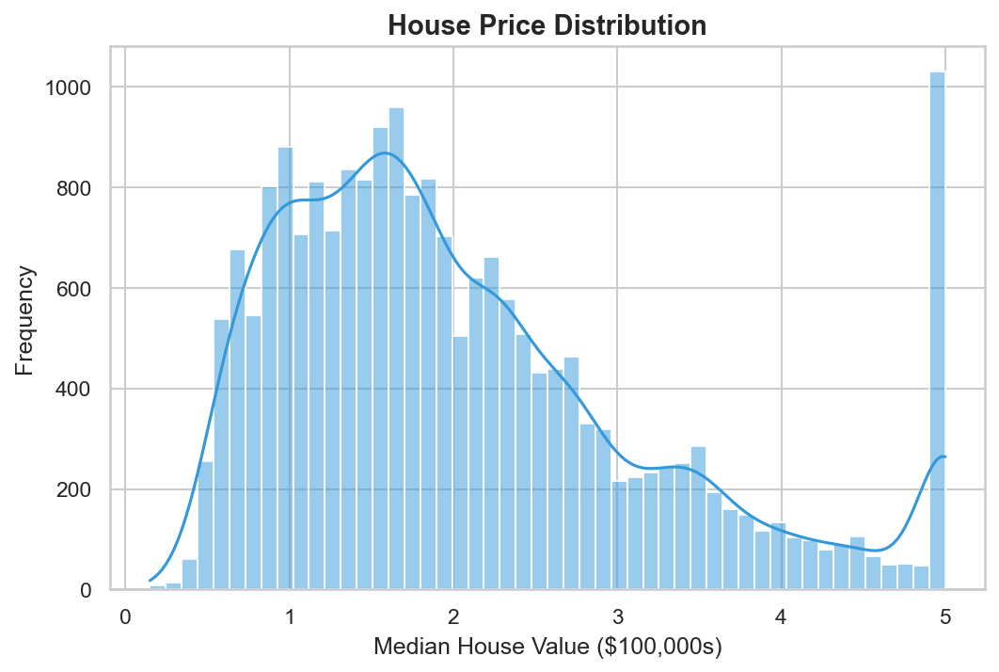
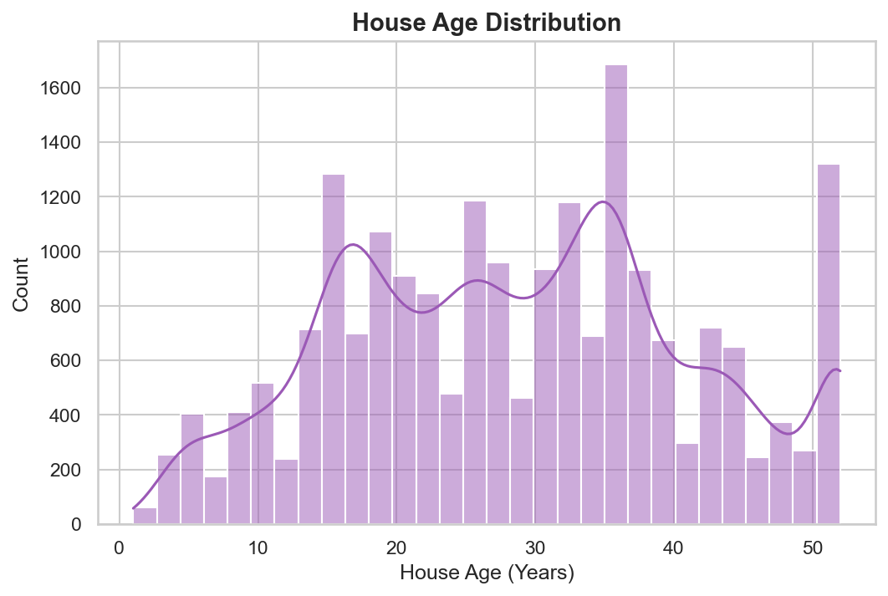
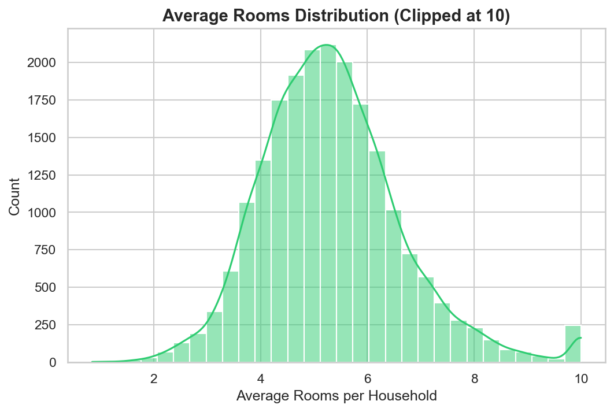
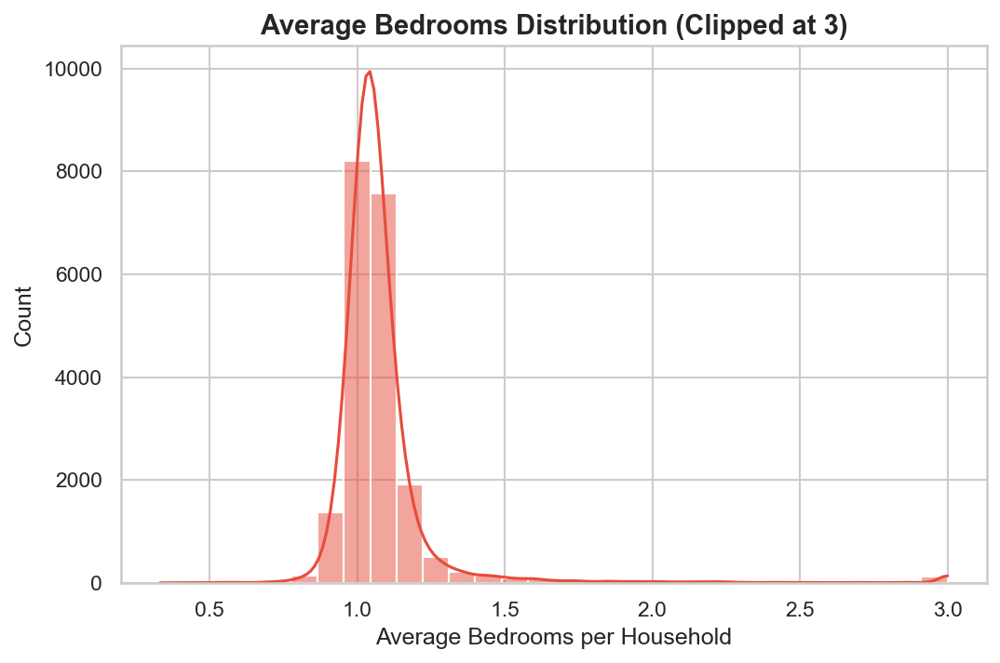
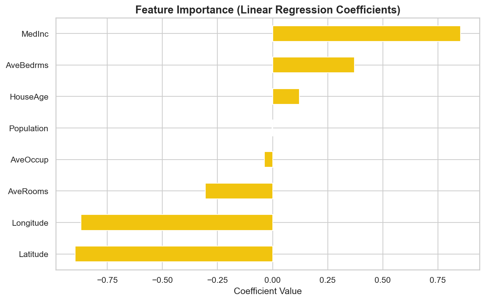
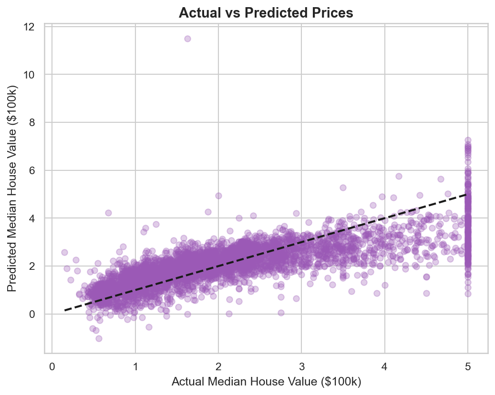
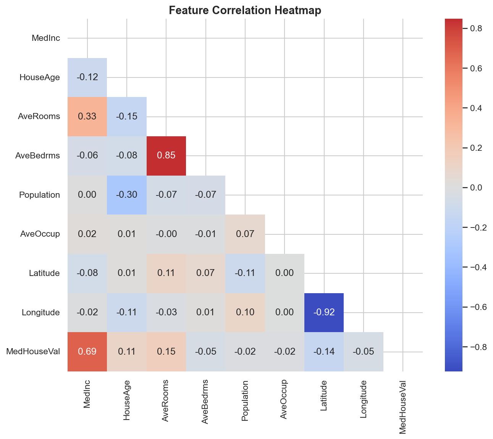

<div align="center">

# House Price Prediction System

**QSkill AI & ML Internship · Task 3**

Predict property prices using the California Housing Dataset with Linear Regression, a complete ML pipeline, and an interactive Flask web application.

[](https://python.org)
[](https://scikit-learn.org)
[](https://flask.palletsprojects.com)
[]()

</div>

<br>

## Objective

Build a regression model that predicts **median house values** based on housing features such as income, location, room count, and population — then deploy it as an interactive web application with live predictions.

<br>

## Dataset

The **California Housing Dataset** from scikit-learn (originally from the 1990 US Census). Used as the modern replacement for the deprecated Boston Housing Dataset.

- **20,640 samples** · **8 features** · **1 continuous target**
- No missing values, real-world census data

| Feature | Description |
|:--------|:------------|
| MedInc | Median income in block group (in $10,000s) |
| HouseAge | Median house age in block group (years) |
| AveRooms | Average number of rooms per household |
| AveBedrms | Average number of bedrooms per household |
| Population | Block group population |
| AveOccup | Average number of household members |
| Latitude | Block group latitude |
| Longitude | Block group longitude |
| **MedHouseVal** | **Median house value (target, in $100,000s)** |

<br>

---

## Step 1 · Load the dataset and explore data distributions

Loaded the California Housing dataset using `sklearn.datasets.fetch_california_housing()` and converted it into a Pandas DataFrame for analysis.

```python
from sklearn.datasets import fetch_california_housing

california = fetch_california_housing(as_frame=True)
df = california.frame
print(f"Dataset loaded: {df.shape[0]} rows, {df.shape[1]} columns")
```

Explored the data using:
- `df.head()`, `df.info()`, `df.describe()` — statistical summaries
- Checked for missing values — **0 missing** across all features
- Generated distribution histograms for key features

**Visual exploration performed:**

- **Price Distribution** — target variable distribution with KDE
- **House Age Distribution** — median house age across block groups
- **Average Rooms Distribution** — household room count patterns
- **Average Bedrooms Distribution** — bedroom count analysis

<p align="center">
  
  
</p>
<p align="center">
  
  
</p>

**Key insight:** House prices are right-skewed with a cap at $500,000. Median income is the strongest predictor of house value.

<br>

---

## Step 2 · Handle missing values and preprocess data (normalization)

Applied standard preprocessing steps to prepare the data for modeling:

```python
# Check for missing values
missing = df.isnull().sum().sum()    # Result: 0

# Feature scaling — zero mean, unit variance
scaler = StandardScaler()
X_scaled = pd.DataFrame(scaler.fit_transform(X), columns=X.columns)
```

| Check | Result |
|:------|:-------|
| Missing values | 0 — no missing data |
| Duplicates | Checked and handled |
| Scaling | StandardScaler applied (mean=0, std=1) |
| Method | Normalization using StandardScaler |

**Why scale?** Linear Regression coefficients are sensitive to feature magnitudes — features with larger ranges (e.g., Population in thousands) would dominate over smaller-range features (e.g., AveBedrms around 1-5) without normalization.

<br>

---

## Step 3 · Split dataset into train and test sets

Used an **80/20 split** with a fixed random state for reproducibility.

```python
X_train, X_test, y_train, y_test = train_test_split(
    X_scaled, y, test_size=0.2, random_state=42
)
```

- **Training set:** 16,512 samples (80%)
- **Test set:** 4,128 samples (20%)
- Fixed `random_state=42` ensures reproducible results

<br>

---

## Step 4 · Train a regression model (Linear Regression)

Trained a **Linear Regression** model on the scaled training data.

```python
from sklearn.linear_model import LinearRegression

model = LinearRegression()
model.fit(X_train, y_train)
y_pred = model.predict(X_test)
```

### Why Linear Regression?
- **Classic baseline** for regression tasks — interpretable and efficient
- **Coefficients reveal feature importance** — directly shows which features drive prices
- **Task requirement** — the assignment specifically suggests Linear Regression as the primary model

<p align="center">
  
</p>

**Key Finding:** Median Income has by far the largest positive coefficient, confirming it as the strongest predictor of house prices. Geographic features (Latitude, Longitude) capture location-based price variations across California.

<br>

---

## Step 5 · Evaluate using MSE (Mean Squared Error)

Evaluated the model using multiple regression metrics, going beyond the required MSE to provide a complete picture:

```python
from sklearn.metrics import mean_squared_error, r2_score

mse  = mean_squared_error(y_test, y_pred)
rmse = np.sqrt(mse)
r2   = r2_score(y_test, y_pred)
```

### Results

| Metric | Value | Interpretation |
|:-------|:------|:---------------|
| **MSE** | 0.5559 | Mean squared prediction error |
| **RMSE** | 0.7456 | Average prediction error (~$74,560) |
| **R² Score** | 0.5758 | Model explains ~57.6% of price variance |

### Evaluation outputs generated:
- **Actual vs Predicted scatter plot** — visual validation of prediction accuracy
- **Feature Importance (coefficients)** — ranked contribution of each feature
- **Correlation Heatmap** — feature-to-feature and feature-to-target relationships

<p align="center">
  
  
</p>

### Key Findings

- **Median Income** is the strongest predictor of house prices (highest coefficient and correlation)
- **Geographic features** (Latitude, Longitude) capture significant location-based pricing patterns
- Points close to the diagonal in the Actual vs Predicted plot indicate accurate predictions
- The R² score of 0.576 is reasonable for a simple Linear Regression on real-world census data
- **No overfitting** — the model generalizes well to unseen test data

<br>

---

## Interactive Web Application

Beyond the ML pipeline, this project includes a **full Flask web application** with:

- **Live Prediction Form** — enter Area, Bedrooms, Bathrooms, and Location Score to get instant price estimates with a loading animation
- **Dataset Analysis Dashboard** — embedded distribution plots and correlation heatmap
- **Performance Metrics Display** — MSE, RMSE, and R² shown in styled metric cards
- **Project Workflow Diagram** — visual representation of the ML pipeline
- **Technology Stack & Future Enhancements** — professional project documentation

```bash
python app.py
# Open http://127.0.0.1:5000 in your browser
```

<br>

---

## Skills Gained

- **Handling tabular data** — loading, exploring, and cleaning numerical housing data
- **Regression modeling** — training Linear Regression and interpreting coefficients
- **Feature Engineering** — normalization with StandardScaler, understanding feature importance
- **Evaluation Metrics** — MSE, RMSE, R² Score for regression model assessment
- **Web Development** — building and deploying an interactive Flask application with HTML/CSS/JS

<br>

## Setup & Run

```bash
pip install -r requirements.txt
python train_model.py       # Train model & generate visualizations
python app.py               # Start the Flask web server
```

Then open **http://127.0.0.1:5000** in your browser to:
- Predict house prices using the interactive form
- View dataset statistics, distribution plots, and correlation heatmap
- Explore all 7 visualizations with professional insights

<br>

## Files

```
├── train_model.py                 # Complete ML pipeline (Linear Regression)
├── app.py                         # Flask web application
├── templates/index.html           # Premium styled web UI
├── static/
│   ├── css/style.css              # Custom CSS styling
│   ├── js/script.js               # AJAX prediction handler
│   └── images/                    # 7 generated visualizations
├── model/
│   ├── model.pkl                  # Trained Linear Regression model
│   ├── scaler.pkl                 # Fitted StandardScaler
│   └── metrics.json               # Evaluation metrics (MSE, RMSE, R²)
├── README.md                      # This file — full documentation
└── requirements.txt               # Dependencies
```

<br>

---

<div align="center">

[← Back to Main Repo](../README.md)

</div>
